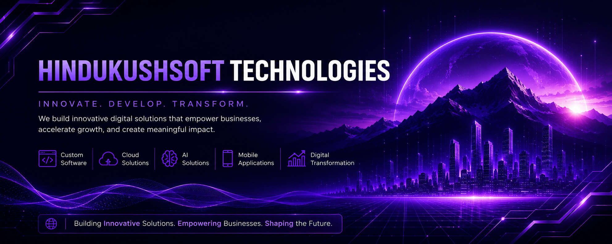

<!-- ======================================================================== -->
<!--              HINDUKUSHSOFT TECHNOLOGIES — GITHUB ORGANIZATION            -->
<!-- ======================================================================== -->

<!-- BANNER — Ultra-wide minimalist technology banner -->

### Building Innovative Software. Empowering Communities.

 

 

We are a Pakistan-based software company creating **scalable, modern, and impactful** digital solutions for businesses, government organizations, startups, and educational institutions. As the **first registered software house in Chitral**, we are committed to technological excellence and community empowerment.

 

 

<!-- ============================== DIVIDER ============================== -->

 

## 🏢 About Us

**HindukushSoft Technologies Pvt. Ltd.** was founded by **Abu Zar Mishwani** and officially incorporated on **May 6, 2025**, with the vision of building innovative, scalable, and impactful digital solutions.

We specialize in designing, developing, and maintaining custom software tailored to real-world needs, from enterprise-grade management systems for government departments to AI-powered applications for modern businesses.

**Registered with the Securities and Exchange Commission of Pakistan (SECP), Federal Board of Revenue (FBR), Pakistan Software Export Board (PSEB)** and recognized by the **National Vocational and Technical Training Commission (NAVTTC)**, we have also signed a **Memorandum of Understanding (MoU) with the University of Chitral** to provide internship opportunities to BS Computer Science students. Under the **PSEB SkillBridge Apprenticeship Program**, we offer paid internship and apprenticeship opportunities in partnership with the **Ministry of IT and Telecom**.

 

### Our Mission
> To help organizations digitally transform their operations through reliable, scalable, and modern software solutions, while creating opportunities for aspiring developers to gain real-world industry experience.

 

### Our Vision
> To become a globally recognized technology company that creates innovative software products while empowering young developers through practical experience, research, and innovation.

 

### Core Values

 

<!-- ============================== DIVIDER ============================== -->

 

## ⚡ What We Build

-  &nbsp; **Custom Web Applications** — Modern, responsive, and high-performance web solutions built with cutting-edge technologies.
-  &nbsp; **Enterprise Software** — Scalable systems for government departments, organizations, and large-scale operations.
-  &nbsp; **AI-Powered Solutions** — Intelligent automation, LLM integrations, and AI-driven workflows for modern businesses.
-  &nbsp; **Mobile Applications** — Custom Android applications designed for performance and user experience.
-  &nbsp; **Cloud Solutions** — Cloud-native applications, SaaS products, and scalable infrastructure.
-  &nbsp; **UI/UX Design** — Beautiful, intuitive interfaces crafted with modern design principles.
-  &nbsp; **APIs & Integrations** — RESTful APIs, third-party integrations, and seamless backend services.
-  &nbsp; **Digital Transformation** — End-to-end digitization of business processes and government operations.

 

<!-- ============================== DIVIDER ============================== -->

 

## 🛠 Technology Stack

### Frontend (Core)

  

### Backend (Core)

  

### Databases

  

### AI & Automation

  

### Mobile

  

### DevOps & Tools

  

### Languages

 

<!-- ============================== DIVIDER ============================== -->

 

## 📦 Featured Projects

### 🏛️ Digitization of Model Farm Services Center - Khyber Pakhtunkhwa (Govt. Project)
> **Status:** ☑️ Production &nbsp;|&nbsp; **Tech:** React · TypeScript · Laravel · MySQL · Vite
> 
> Management Information System for the Agriculture Department of Lower Chitral. A production-grade enterprise solution digitizing government operations, currently being rolled out across all 38 districts of Khyber Pakhtunkhwa under the Government of KP.

 

### 📱 GPA Calculator & Planner
> **Status:** ☑️ Production &nbsp;|&nbsp; **Tech:** Kotlin · Jetpack Compose · Material 3
> 
> The #1 GPA Calculator app worldwide on Android with 50,000+ downloads. A full-scale academic management app supporting multiple grading systems, semester planning, target GPA forecasting, and professional PDF reporting.

 

### 🍽️ Cibao Grille
> **Status:** ☑️ Production &nbsp;|&nbsp; **Tech:** Next.js · Payload CMS · TypeScript
> 
> Full-stack web platform for a fine dining restaurant in Naples, Florida. Features dynamic menu management, CMS-powered content, and a polished brand experience.

 

### 🏨 Hotel Innjigaan
> **Status:** ☑️ Production &nbsp;|&nbsp; **Tech:** React.js · TypeScript · Vite · Tailwind CSS
> 
> Custom hospitality website for a hotel in Chitral with room showcases, booking inquiries, gallery, and brand-aligned design. Integrated with desktop hotel management software.

 

### 💻 Inventro POS
> **Status:** ☑️ Production &nbsp;|&nbsp; **Tech:** Electron · React · TypeScript · SQLite
> 
> Desktop point-of-sale and inventory management system for retail businesses. Features billing, inventory tracking, supplier management, khaata management, expense tracking, and role-based access.

> **Note:** This table will be updated as we continue to ship and open-source more projects.

 

<!-- ============================== DIVIDER ============================== -->

 

## 🌍 Open Source

We believe that great software is built in the open. HindukushSoft Technologies is committed to contributing to the open-source ecosystem and sharing tools, libraries, and solutions that can benefit developers and communities worldwide.

**Our open-source philosophy:**

- **Give back** to the communities and tools that power our work
- **Share knowledge** through well-documented, production-quality code
- **Collaborate** with developers across the globe
- **Build trust** through transparency and open development practices

We are actively working on open-sourcing internal tools and contributing to existing projects. Watch this space for upcoming releases.

 

<!-- ============================== DIVIDER ============================== -->

 

## 🎓 Internships & Careers

HindukushSoft Technologies runs one of the most practical internship programs in the region. Unlike traditional classroom-based training, our program emphasizes **real-world software development** from day one.

We are an official partner under the **PSEB SkillBridge Apprenticeship Program** (Ministry of IT & Telecom), offering **paid internships and apprenticeships**. We have also signed a **MoU with the University of Chitral** to provide structured internship opportunities to BS Computer Science students.

**What our interns experience:**

- Hands-on development with production technologies
- Daily coding exercises and weekly project sprints
- Git, GitHub, and professional development workflows
- Code reviews and agile development practices
- Mentorship from experienced developers
- Real client-inspired projects

We have successfully completed **three internship batches**, producing developers who are now working professionally, including within HindukushSoft itself.

 

**Interested in joining us?**

 

<!-- ============================== DIVIDER ============================== -->

 

## 📬 Get In Touch

 

 

**Office Contacts:**
- 📞 **Office:** 0943 219679
- 📱 **Mobile:** +92 306 216 9608
- ✉️ **Email:** [info@hindukushsoft.com](mailto:info@hindukushsoft.com)
- 📍 **Address:** Office 1, Polo View Hotel, Polo Ground, Attaliq Bazar, Chitral, Pakistan
- 🕒 **Hours:** Mon - Fri: 9:00 AM - 5:00 PM

 

<!-- ============================== DIVIDER ============================== -->

 

 

**Technology should solve real problems, create opportunities, and empower communities.**

Founded in Chitral. Building for the world.

 

© 2026 HindukushSoft Technologies Pvt. Ltd. All rights reserved.

 
 

